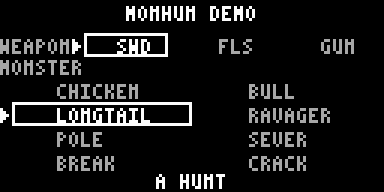

# monhun-ardu

Monster-Hunter-style top-down duel game for **Arduboy FX** (ATmega32u4), rendered
in 4-shade grayscale via ArduboyG `L4_Triplane`. `src/` is the source of truth;
`mock/` is the legacy browser prototype the sim was originally ported from (its
parity image stays runnable as diagnostics, not as a commit gate).

---

## Demo



Download `monhun-ardu-<version>.arduboy` from
[Releases](https://github.com/FreezingSnail/monhun-ardu/releases) and flash it
with the Arduboy Toolset, MrBlinky's
[uploader.py](https://github.com/MrBlinky/Arduboy-Python-Utilities), or Ardens.
The archive carries both the Arduboy FX and the Arduboy Mini program plus the
single FX data image (`flashdata`); the plain hex files are attached for manual
flashing. Controls are below; no USB serial device comes up while the game runs
(see the shipping-build note).

---

## Status snapshot

| Item | State |
|---|---|
| Vertical-slice sim | Ported + parity-verified (20 scenes / 1269 ticks / 660 device asserts) |
| Device render + HUD + audio | Working (block/FX-sprite art, cue tones; HUD text/FX glyphs + bars — `7y3` clamp fixed) |
| Host unit tests | `make test` — **6232 passed / 0 failed** |
| Device tests (Ardens) | 17 suites / 1712 asserts — boot 4, assets 264, audio 9, hud 29, data 348, combat 237, hub 77, monster_art 127, player_art 120, quests 87, screens 136, smith 51, cards 83, tell 18, zones 82, items 35, perf 5 — all PASS (the frozen `test_parity` diagnostics image is not a gate; the opening-menu `test_menu`/`test_menu_art` suites and its `mh_menu_*` sheets were deleted with the menu, `isp.1`/`hml.2`) |
| Perf gate (`monhun-ardu-8v7`, re-verified through `kt7.7`) | **PASS.** plane 157 Hz (≥135), logic 52 Hz (≥45), render max 3348 µs (≤7407), tick 480 µs, RAM free 689 B (bench) |
| Perf tooling | Headless Ardens profiler dump (`profiledump=<path>`, local patch) + on-device cycle bench (`test_perf`) |
| Shipping build | flash **29172 / 29696 B** (524 free), RAM **1764 / 2560 B** (796 free); USB-free, see below |
| FX data image | **298925 B** of 16 MB used (96 KB of it is the 32 prebaked detail-card pages) |

Speculative gameplay status: combat (sword / flail / gunshield), monster FSM,
camera/world clamps, HUD, audio cues all in place. The prg.8 trim removed
training mode (the pole and its room), damage-number text, screen shake, the
projectile trail, the rare cues (part break / gather / eat / windup), and the
stage-3 finisher + direction+A opener / roll attack (`MH_STAGE3=0`,
`MH_ROLL_ALT=0` shipping; the carves stay for tests). The procedural ground-dot
field is kept (the shipping ground; only the room-image blit would cover it).
The prg.11 trim then cut charge to a single melee level (no `CHARGE_L2`, no
charged ball), replaced the procedural tell shapes with a windup
animation-frame selector (the `tell` byte picks the beast's authored windup
pose; unauthored tells fall back to the 2x2 core marker until prg.12 authors
the frames), and carved the A-A-B branch buffer + player-move push flag out of
shipping (`MH_B_BRANCH_BUFFER=0`, `MH_PUSH_MOVE=0`; the carves stay for tests):
**−862 B flash**. Perf-verified on device. Remaining: real art pass (`vx2`,
human), feel tuning (`1to`, human), EEPROM save (`qyb`, deferred).

---

## Architecture

```
mock/game.js ──port──► src/core/*.hpp ──shared verbatim──► host tests (tst/*.hpp)
                              │                              and device .ino
                              │
                    device layer (monhun-ardu.ino)
                    ├─ input sampling (pollButtons → mh::Input)
                    ├─ render.hpp (arena, actors, FX sprites, HUD)
                    ├─ audio.hpp (edge-diff cues → ArduboyTones)
                    └─ ArduboyG plane loop + FX/OLED bracket
```

### Core (`src/core/`, header-only, no `Arduino.h`)

| Module | Responsibility |
|---|---|
| `fp.hpp` | Fixed-point layer: FP=16 (1/16 px), `tdiv`, `addMove`, `addVel`, `DIR8`, 8-way dir math, `isqrt`, `rotFp`, stamina drain, `FpBody`/`FpStam` |
| `game.hpp` | `Game` state, `Player`, weapon defs + monster attack tables (PROGMEM), `Rect`, hit callbacks, `HOLD_TICKS=11`, `WORLD_W=256`, `WORLD_H=112` |
| `player.hpp` | Player FSM: chains/branches/stances, stamina, guard/parry/deflect, gunfire flags |
| `monster.hpp` | Monster FSM, attack cycle, windup, hit resolution, `pushApart` |
| `projectiles.hpp` | Shells (`ball`/`scatter`), effects (sparks), `stepWorld` |
| `world.hpp` | Screen geometry constants, camera (int px, clamped), hunt mode, `newGame`, `withWeapon`, `resetHunt`, `stepGame` |
| `combat.hpp` | Combat blob loader (`ljj.2`, reworked by `cgk`): one production reader over the generated `combat_data.hpp` (host) / `mhCombat` blob (AVR), `creatureLoad`/`attackLoad` caches in `Game::combat`, guard eval with deterministic tick-derived chance, and the fixed 3-hitzone resolve (implicit body + optional head/appendage records). No per-tick cart reads |
| `input.hpp` | Edge flags + B-hold detection (`aP`, `bP`, `bR`, `bHeld`), no Arduino headers |
| `progmem.hpp` | Portable flash-read shim: `MH_PROGMEM` + typed `mhPgmRead*`; identity on host |

**Fixed-point discipline**: no float or double anywhere in the sim. Positions are
integer pixels plus a 1/16-px sub-pixel accumulator; projectile `x/y` are stored
directly in 1/16-px units and integrated by straight addition.

### Device layer

- `monhun-ardu.ino` — plane loop, input sampling, `stepGame()` + `audioUpdate()`
  in `run()`, `renderScene()` in `render()`. Boots straight into the **hub** (the
  root screen, `isp.1` deleted the opening menu); while a screen is active the
  sim/audio are skipped and `drawScreen()` replaces the scene; while a detail
  card is open (`DetailState::active`) `drawCard()` replaces everything and A/B
  drive the card, with A running the stored row's action through
  `screenApplyAction`. The hub HUNT row
  starts the save's hunt (`huntStart`), win/loss + A returns to the hub, and the
  camp hold-B leaves to the hub. FX reads happen inside `FX::enableOLED()` /
  `waitForNextPlane()` / `FX::disableOLED()`.
- `src/app_state.hpp` — host-testable app routing (qs.4; hub-as-root `isp.1`):
  the hub is the root (`appScreenBack(HUB) == APP_NAV_NONE`), its HUNT row
  requests a hunt (`appNavApply(APP_NAV_HUNT)` returns true; the caller starts
  it), camp hold-B routes to the hub (`appHubRequest`), the held-button guards,
  the over-screen return edge (`appOverReturnStep`) and the once-per-hunt
  progress commit.
- `src/app_setup.hpp` — device cart glue for a hunt start: `huntStart()` picks the
  beast kind from the active `QuestDef` (kill target, else LUNGE) and the save's
  v4 weapon, then arms the quest kill counter and resolves the smith tier
  multipliers.
- `src/armor_state.hpp` — host-testable armor engine (arm.2): crafted/equip save
  helpers and `armorAggregate()` (defense/resist/skill-point sums + S/M tiers).
- `src/armor.hpp` — device cart glue: reads `mhArmor` and caches the equipped
  stats into `Game::armor`/`Game::armorHead` at hunt start and on equip change.
- `src/card_state.hpp` — host-testable detail-card state machine (5co.3;
  ui.3.1 added the armor craft bill): the `DetailState` page mask/machine (open
  on the first present page, LEFT/RIGHT cycles only pages in the mask, B backs
  out), the list-row -> card kind/global-index mapping, the crafted-armor
  PARTS trim, the armor card action (`cardArmorApply`: craft from the baked
  bill, then equip/unequip), and the dynamic hint rule (`A CRAFT` /
  `A EQUIP` / `A UNEQUIP` / `A ACCEPT` / `A TURN IN` / `NEED PARTS` /
  `NEED ZENNY`).
- `src/cards.hpp` — device cart glue for the cards: reads the `mhCards` record
  with one bulk `mhFxReadBytes` into a byte-identical `CardItem` cache
  (`static_assert`d), blits the baked 128x64 page through `cardBlit`
  (`src/render.hpp`, one 1024 B layer per plane), and draws the meta overlay
  slots (live PARTS have-counts, the quest PROG bar) plus the hint line. A
  card action reuses `screenApplyAction` with the list row that opened it.
- `src/render.hpp` — whole render path (also compiled into the perf bench so
  measured numbers describe the real loop). Arena, target, player, shells,
  effects, HUD, and the fixed 128x64 card blit (`cardBlit`).
- `src/audio.hpp` — cue detector diffing `Game` edges after `stepGame()`;
  non-blocking one-shot tones via ArduboyTones (Timer3, no Timer1 conflict).
  Mute with `-DMH_AUDIO=0`.
- **USB-free shipping main** (`monhun-ardu.ino`, `-DMH_NO_USB`): shipping builds
  compile the sketch's own `main()` so the core archive's `main.cpp.o` is never
  pulled in — that object is the only thing that calls `USBDevice.attach()` /
  `serialEventRun()` and drags in the CDC/PluggableUSB stack. The game never uses
  `Serial`, so this reclaims flash/RAM with no behavior change. `-DMH_NO_USB` is
  set only by the shipping flags (`Makefile SIZE_FLAGS`, used by
  `build`/`mini`/`size`/`debug`). The Ardens `fxtest` sketches are compiled by
  the separate `fxtest-build` arduino-cli invocation with stock flags, so they
  keep the core main and `captureserial` still works. Consequence: the shipping
  build has **no USB serial device** (no serial monitor / no OS port while the
  game runs); uploads go through the Cathy3K bootloader window
  (`arduino-cli upload` resets into it as usual).

### FX asset pipeline (all assets live on the FX chip)

```
mock/game.js + core dims ──tools/gen-art.py──► images/**/*.png
images/**/*.png ──tools/convert-sprite.py──► fxdata/*/Sprites.txt ──┐
                                                                    ▼
data/skeletons.json + data/creatures/*.json ──tools/gen-combat.py──►│
        ├─► fxdata/tables/combat.bin ──────────────────────────────┤
        └─► src/generated/combat_{data,meta,expect}.hpp            │
                                                                    ▼
                     fxdata/fxdata.txt ─► tools/gen.sh ─► fxdata-build.py
                                                           │
                              src/fxdata.h (offsets) ◄─────┤
                              fxdata/fxdata.bin      ◄─────┘
```

- Sprites and fonts are packed for `SPRITESU_FX`; drawn with
  `SpritesU::drawPlusMaskFX(x, y, img, FRAME(i))` where
  `FRAME(x) = x*3 + arduboy.currentPlane()`.
- MCU flash holds only `src/fxdata.h` offset constants and code. No glyph or
  bitmap arrays in MCU flash or RAM.
- Creature combat data is authored as JSON under `data/` and compiled by
  `tools/gen-combat.py` into the packed blob + generated headers described in
  `docs/creature-framework.md` (blob format §8, schema §§3-7, reference values
  §11). The blob is a `raw_t mhCombat` section of the one FX image (never a
  second flashable image); `combat_meta.hpp` carries VERSION/SIZE and the
  per-record offsets the loader uses, `combat_data.hpp` is the host mirror and
  `combat_expect.hpp` pins sizes, spot values and the blob sha256.
  `src/core/combat.hpp` is the production loader (host structs / AVR
  `mhFxRead*`), exercised by `tst/combat_test.hpp`,
  `tst/combat_pack_test.hpp` and the Ardens `test_combat`; the game runs the
  pattern interpreter from migrations `ljj.3`–`.5`; `data/creatures/
  ravager.json` was the first creature with zones (head + appendage, `cgk`, and
  `heavy.json` gained its appendage/long-tail zone in `4t4`), replacing the
  N-part machinery of `ljj.6`/`ljj.8`: body implicit, one u8 pool + one broken
  record per zone, broken-mask guards. Every breakable demo-roster zone overlays
  its part at the cached zone box (`src/render.hpp` `drawZonePart`): the heavy
  `fxtail_heavy` 24x16 tail (`4t4`) plus the `kt7.6` chicken `fxhead_chicken`/
  `fxlegs_chicken` and bull `fxhead_bull`/`fxhooves_bull` 4-frame sheets, broken
  variants erasing the baked part with shade-0 pixels (RAVAGER keeps the legacy
  18x10 `fxtail` unoverlaid; page stride). The
  zones machinery is
  folded out of the `test_perf` and `test_parity` images with
  `-DMH_COMBAT_PARTS=0` (see `src/core/game.hpp`), whose scenes never run the
  ravager; shipping and `test_combat` keep it.
- Current blobs: `fxmonster`, `fxplayer`, `fxpole`, `fxball`, `fxscatter`,
  `fxspark`, `fxfontw`, `fxfontg`, the overlay/effect sheets and the raw
  content tables (`mhWeaponDefs`, `mhMonsterAttacks`, `mhMonsterDefs`,
  `mhCombat`, `mhCards`) — 298925 B cart image total. The dead
  `mh_menu_bg`/`mh_menu_wsel`/`mh_menu_msel` sheets were dropped with the
  opening menu (`hml.2`).
- Detail cards (`tools/gen-cards.py`, ui.3): `data/armor.json` +
  `data/skills.json` + `data/quests/*.json` compile into one 128x64 page image
  per item page under `images/cards/` (3x 1bpp page-major layers in
  `fxdata/cards/Sprites.txt`, the same family as the room images), the packed
  `fxdata/tables/cards.bin` record table (mask + page image addresses + overlay
  slots + the armor craft bill: zenny + up to two `{itemIdx+1, count}` pairs)
  and `src/generated/card_meta.hpp`. A page with no data is not
  generated. `python3 tools/gen-cards.py --sheet build/cards_contact_sheet.png`
  renders every page into one review grid (never committed); `--dump` lists the
  masks/overlays without writing.
- Regenerate with `make gen` (or `./tools/gen.sh`); bins are tracked despite
  `*.bin` being gitignored (force-added) so device tests are reproducible.
- `fxdata/manifest.json` (tracked) pins sha256+size for every source image,
  JSON source, fxdata declaration and generated artifact;
  `tools/fxdata_manifest.py --check` verifies it read-only and `make gen-check`
  re-runs the pipeline and fails if any generated artifact changes (staleness
  or nondeterminism).
- `make test-tools` runs the Python unittest suites in `tools/tests/`
  (manifest orphan/missing/malformed/staleness fixtures; gen-combat schema
  errors, id/ref errors, integer-only rejection, size limits, determinism,
  dump smoke, blob-ABI spot checks; contact-sheet determinism/layout).
- Authoring review without flashing:
  - `python3 tools/gen-combat.py --dump` validates the JSON and prints the
    compiled model (per-creature stats, attacks, windows, patterns and guards)
    without writing any artifact — the fast schema/id cross-ref check while
    tuning numbers.
  - `python3 tools/contact_sheet.py [--creature <id>] [--out build/x.png]`
    renders `data/skeletons.json` + `data/creatures/*.json` to a PNG contact
    sheet under `build/` (never committed): a tick timeline per attack
    (windup/active/recover shading, window spans) plus one 1:1 preview per hit
    window showing the body box and the window box, so a multi-window arc,
    part box or timing change can be reviewed as a picture. `--dump` prints a
    downsampled ASCII view for text evidence.
- Fonts are drawn from the FX cart (vendored `Font4x6` was deleted after the
  asset pass; it cost ~3 KB of flash).

### Test tiers

1. **Host unit tests** — `make test`. `tst/test.hpp` (Test/TestSuite/TestRunner),
   suites in `tst/*_test.hpp`, `tst/main.cpp`. Binary in `build/tests/host`.
   Runs the core headers unmodified.
2. **Device tests** — `make fxtest-headless`. Stages each
   `tst/fxdatatest/test_*.ino` under `build/fxtest/<name>/`, compiles with
   arduino-cli, boots it in Ardens with the FX image on `d1`, and requires a
   final bare `P` (pass) or `F` (fail) marker over serial.
   - `test_boot` — boots, camera pin
   - `test_assets` — reads FX blobs inside the OLED bracket, checks plane bytes
   - `test_audio` — cue-map asserts with real tones
    - `test_data` — FX-cart weapon/monster tables match the mock values and packed layout
    - `test_combat` — combat blob loader: header/spot values, cross-refs, guard eval, damage routing, cache read counts
    - `test_cards` — mhCards cart reads (incl. the baked armor craft bill), list-row -> card mapping, card action E2E (armor craft/equip, take/turn-in + EEPROM), card page blit + overlay pixels across planes
    - `test_parity` — replays mock-generated traces tick-by-tick vs core
   - `test_hud` — pins HUD bar/divider framebuffer bytes + world-clip control
   - `test_perf` — cycle-based bench + budget gates
   - Fixtures for parity are generated with
     `node tools/gen-parity-fixtures.js` (Node only produces fixtures; the test
     itself is C++/Ardens).
3. **Ardens** is required for tier 2; override with `ARDENS=/path/to/Ardens`.
   If it is missing, `fxtest-headless` skips cleanly.

### Hardware / cadence

- `L4_Triplane` + `ABG_TIMER1` + `ABG_SYNC_PARK_ROW` (`src/common.hpp`).
- Measured under load (bench): **156 Hz plane sweep, 52 Hz logic**, render max
  4868 µs/plane, logic tick 540 µs, 572 B free RAM. Mock runs 60 Hz; tick order
  is equivalent.
- Debug overlay `DEBUG_HURTBOXES=1` (hold A+B to toggle). Off by default; the
  overlay build is flash-tight and only for development.

---

## Controls

### Hub (boot — the root screen, `isp.1`)

Boot lands on the hub; the opening menu is gone (`isp.1`). The hub is the root,
so B there is a no-op.

| Input | Action |
|---|---|
| UP / DOWN | move the cursor (6 rows per page, scroll by 6) |
| A | accept the cursor row (start hunt / open a screen / open a card / take a quest) |
| B | back one level (quests/gear → hub; hub B is a root no-op) |

D-pad nav is debounced: a tap moves exactly one row (immediate on the direction
change), while holding waits ~300 ms (16 logic ticks) and then repeats every
~115 ms (6 ticks). A is edge-based: one accept per press, and the press that
opened a screen cannot re-fire inside it. The hub HUNT row starts the save's
hunt: `huntStart()` reads the active quest's `QuestDef` (a `kill` goal spawns its
target beast, anything else — no quest or a `gather` goal — falls back to the
LUNGE beast) and the save's equipped forge node (v5), then runs `newGame` + the
camp spawn.
After a win or loss, A returns to the hub so the finished quest can be turned in;
the next HUNT runs `newGame` again, so projectiles/effects/quest counters start
clean. While a screen is up the sim and audio are not stepped.

The hub shows HUNT / QUESTS / FORGE / GEAR. Every list screen carries the live
`save.zenny` balance right-aligned on the title line (`$` + digits, ui.5); the
old HUB ZENNY row and its `ROW_F_ZENNY` dynamic-value token are retired. The
quests board takes a quest and turns it in for its reward. ui.3.1 (5co.6)
removed the SMITH screen and ui.4 (5co.4) added the FORGE trees, which own all
weapon progression: armor crafting moved onto the GEAR armor card (below) and
the camp smithy interaction was dropped with the screen.

Hub chrome (ui.5.2, 5co.9): the HUNT row's right column shows the active quest's
progress (`2/3`), `READY` once progress >= need, or `-` with no active quest
(replacing the packed cost, which is always 0 on the hub). A bottom strip on the
free y=56 line shows the equipped weapon marker (`SWD1` — the class abbreviation
+ forge-tree tier) and the active armor skill point totals (`ATK12`, tiered
skills only; no all-skills screen). Any list spanning more than one 6-row page
carries an `n/m` page indicator after its title. A blocked A — a gated list row
or a card whose hint is `NEED PARTS` / `NEED ZENNY` / silent — plays a short
denied cue, reusing the low `CUE_HURT` tone (no new cue row). The generator caps
titles and labels at 16 chars, so the renderer draws the batched cart fetch only;
the old per-char tail fallback was dead and is gone (5co.9 trim).

The FORGE screen (`data/screens/forge.json` + generated rows from
`data/forge/*.json`) lists every weapon node as an indented tree (class headers
+ one `ACTION_FORGE_NODE` row per node, label + upgrade cost). A opens the
weapon card (`DESC / PARTS / STATS`); A on the card forges the node — an upgrade
when the parent is owned (cheaper bill, transforms the owned parent, and moves
the equipped id to the child if the parent was wielded), otherwise a pricier
direct forge that leaves skipped nodes unowned. Skipped branches stay locked
until an owned parent exists.

The GEAR screen equips the loadout. The weapon rows (`ACTION_EQUIP_WEAPON`,
generated from the same tree) open the weapon card, whose A equips an owned node
or unequips the wielded one; the equipped node id persists in the save (v5). The
five armor pieces (`ACTION_EQUIP_ARMOR` rows, gs.1) are always live, because the
card's A crafts an uncrafted piece (debit + crafted bit) before toggling equip.
A same-weapon / same-piece press is a no-op and the next HUNT starts with the
picked loadout; the owned/crafted bitsets and the equipped ids persist in the
save, and the equipped stats cache at hunt start (arm.2). The GEAR page also
carries a live skill readout (gs.2): five `ROW_F_SKILL` rows (ATTACK UP /
DEFENSE UP / HEALTH UP / STAMINA UP / EVADE) show each skill's stacked points,
and an active skill gets an `S` (points >= 10) or `M` (points >= 15) letter just
left of the number; points clamp at 15. The cache refills when GEAR is entered
and after every equip action, so the numbers move as gear changes. An items
screen is still a follow-up; the equipped weapon's hub strip marker (ui.5.2) is
the only loadout readout outside GEAR. Every state-changing action commits the 44-byte EEPROM save block
once (write-on-change + verify read). A save with an active quest applies it at
hunt start and the hunt-end quest-progress commit still runs exactly once per
hunt. Camp hold-B (sheathed) leaves the hunt back to the hub. There is no quit
input in the hunt — win/loss + A is the only hunt exit.

Save v5 caps are fixed and data-only to grow below them: **32 owned weapon-node
slots (4 B)** and **8 crafted armor-piece slots (1 B)** (`core/save.hpp`). There
is no migration (ui.4.1, owner decision): only a version-5 record with a valid
checksum decodes; anything else (blank, junk, or an older version) falls back to
`saveDefaults()`, so an old save is discarded on a version change. Widening the
bitsets (e.g. 16 armor pieces) is a future budget event, not a data-only change.

Armor, quest, and weapon rows open a **prebaked detail card** (ui.3/ui.4)
instead of firing the action on the list: A on the list opens the card,
LEFT/RIGHT cycles its pages (DESC/PARTS/STATS/SKILL for armor; DESC/PARTS/STATS
for weapons; GOAL/PROG/REWARD for quests), B backs to the list, and A on the
card performs the row's context action (forge/upgrade, craft/equip/unequip, or
take/turn-in). The armor craft bill (zenny + up to two `{item, count}` pairs) is
baked into the `mhCards` record (ui.3.1), so the card gates and debits the craft
itself; quest cards still run the row action. Everything is baked into the
128x64 page image except the hint line and the live overlay slots (PARTS
have-counts, the quest progress bar); a crafted armor piece loses its PARTS page
immediately, so the card cannot offer a second craft. The live per-row state
(equipped / owned / upgradeable / direct / need-parts / need-zenny) is carried
by the card hint line, not a list token column (ui.4.1 trim).

### Target roster (`MONSTER_DEFS`, FX cart blob)

| Target | Mode | Size | HP | Spd | Attack |
|---|---|---|---|---|---|
| LUNGE | hunt | 32x24 | 1800 | 5 | pecks inside 28 px, leaps 29..41 px (leap locks facing at windup) |
| SWEEP | hunt | 28x22 | 1500 | 7 | stomps inside 24 px, gores 25..41 px (gore locks facing at windup) |
| HEAVY | hunt | 40x28 | 2800 | 3 | lunges inside 24 px |
| RAVAGER | hunt | 32x24 | 2600 | 6 | breakable head/appendage zones (ljj.6), pattern-driven |

### In game (hunt)

| Input | Action |
|---|---|
| D-pad | move |
| D-pad double-tap | dodge roll toward the tapped direction (all weapons, sheathed too — same sword roll; stamina + state gates as the B tap) |
| B held + double-tap Down | sheathe (stow the weapon); A draws — rooted per-weapon windup (sword 6 / flail 10 / gun 16 ticks), then combo hit 1 |
| A | attack (in a stance: stance special) |
| A (sheathed, at a herb node) | gather the node (rooted ~40 ticks; a tap away from a node draws instead) |
| B tap | dodge (sword) / deflect (flail) / shove (gunshield); inert while sheathed |
| B hold ~11 ticks | enter stance (parry / whirl / guard); release exits |
| B hold ~11 ticks (sheathed, herb held) | eat a herb: +20 hp, rooted ~40 ticks; a shorter hold does nothing (roll is the double-tap) |


---

## Commands

```sh
make test               # host unit tests (6190 asserts)
make fxtest-headless    # Ardens device tests (18 suites; FXTEST_ONLY=test_combat for one)
make size               # whole-image flash/RAM report + compile-time data facts
make gen-check          # regen determinism + generated header sync
make build              # compile shipping sketch (output in dist/)
make debug              # build, then open Ardens debugger (ELF + DWARF) with FX image
make mini               # compile for Arduboy Mini FQBN
make gen                # regenerate FX assets + fxdata.h/bin from images/
make hooks              # install git hooks (clang-format pre-commit), once per clone
make format             # format all tracked C-family sources
```

Workflow conventions (budget spikes, data facts, generated-artifact rules,
render review checklist) live in `docs/dev-flow.md`.

`make debug` launches Ardens on `dist/monhun-ardu.ino.elf` (DWARF debug info
for source view, symbols, globals, call stack) + `fxdata/fxdata.bin`
(windowed, FX cart on `d1`, SSD1306). Debugger keys: `F5` pause/continue,
`F8` reset, `O` settings, `F11` fullscreen.

Also available there:
- **CPU profiler** — instruction-level inclusive CPU load and raw cycle counts,
  hotspot list, annotations on source/disassembly. Open via the debugger menu
  (Profiler) or set `open_profiler=1` in `Ardens.ini`. **Headless dump** (no
  window, scriptable/agent-readable):
  ```sh
  "$ARDENS" headless=3000 display=ssd1306 fxport=d1 \
      profiledump=build/profiler.txt \
      file=dist/monhun-ardu.ino.elf file=fxdata/fxdata.bin
  ```
  Writes tab-separated `count/pct/begin/end/symbol` rows (top 50, sorted) plus
  total cycles and CPU-active %. Requires the ELF from `make build`. Note: the
  `profiledump` parameter is a local Ardens patch (uncommitted in
  `~/code/Ardens/src/headless.cpp` as of this writing).
- **Auto-breaks**: stack overflow, null deref, out-of-bounds, SPI write
  collision, FX busy access — useful when touching render/FX code.
- Snapshots (`F4`), display screenshots (`F2`), GIF recording (`F3`).

Notes:
- `build`, `mini`, `gen`, `debug`, `hooks`, `format`, `test`, `fxtest*` are all
  `.PHONY`, so `make build` always recompiles even when `build/` (host tests,
  staged fxtests) exists.
- `make build` does not tolerate a stale `dist/`; it overwrites as needed.
- **Formatting**: `.clang-format` (LLVM base, 4-space, 200 col, LF) defines the
  style. `make hooks` sets `core.hooksPath=.githooks`; the pre-commit hook runs
  `clang-format` on staged C/C++/`.ino` files and restages them. Vendored
  (`src/external`, `Arduboy-Python-Utilities`) and generated files
  (`src/fxdata.h`, `fxdata/fxdata.h`, `tst/fxdatatest/parity_fixtures.hpp`) are
  skipped. Override the binary with `CLANG_FORMAT=/path/to/clang-format`.

---

## Challenges / known issues

1. **Perf resolved, headroom watched.** Two render fixes landed:
   `drawArena()`'s per-dot signed modulo field (~6044 µs/plane) became
   incremental counters plus a `MAX_FX_DRAW=6` render-side effect cap
   (`80bbfb0`), and `blk()`'s `fillRect`/`drawFastVLine` path was replaced with
   direct masked framebuffer writes (`816767d`) — render max 13312 → 3984 µs,
   plane 82 → 156 Hz, logic 27 → 52 Hz, profiler `mh::blk` share 29% → 3.6%.
   Any new feature must fit flash (2226 B free) and keep the perf gates green.
2. **Flash headroom**: shipping 27470/29696 B (2226 B free) after the
   USB-stack removal (`42n.8`: custom USB-free `main()`, -2666 B flash /
   -140 B RAM, see the device-layer note), the content-table offload
   (`42n.1`-`42n.4`), the sine-LUT shrink (`42n.7`; the
   65 B quarter-wave table + sign fold), the opening menu (`6zb.2`, +1604 B
   for the menu state machine, FX-glyph render and the runtime monster-kind
   start path), d-pad nav debounce (`6zb.4`, +16 B for the per-axis hold
   timers) and the combat blob pipeline (`ljj.1`; blob is FX data, shipping
   flash unchanged). The hub-as-root rework (`isp.1`) then deleted the opening
   menu (FSM + FX render + its suites) and reclaimed 470 B; the menu art cleanup
   (`hml.2`) dropped the dead `mh_menu_*` sheets from the cart (flash unchanged,
   -8262 B FX data). Shipping measures **28848/29696 B (848 free)**. The 119 B of hot LUTs (`mh::SIN65`
   65 B, `fp::DIR8` 32 B, `mh::MH_MASK_TOP/BOT` 16 B, `mh::RING6` 6 B) stay in
   MCU flash by decision (`monhun-ardu-42n.5`): FX per-access reads measured
   ~150 cycles (~9 µs, 20-35x an LPM) and a SIN65 RAM cache would breach the
   300 B free-RAM gate. The 65-entry quarter-wave SIN65 table + quadrant sign
   folding (`42n.7`) is bit-identical to the old 256-byte table (pinned by the
   exhaustive host suite `tst/sin_test.hpp`). Any new feature must still budget
   flash, prefer FX data; debug-only code (`DEBUG_HURTBOXES`) must stay behind
   compile-time flags.
3. **RAM history**: constant tables originally sat in AVR `.rodata` (RAM) at
   2494 B used; moved to PROGMEM (MCU flash) via `progmem.hpp` → 1888 B. Audio
   added timers/state → 1941 B; the opening menu's 5 B `MenuState` → 1946 B; its
   per-axis nav hold state (`6zb.4`) → 1950 B; the `ljj.2` combat loader caches
   in `Game::combat` (22 B profile + 21 B attack/window + 7 B runtime = 50 B)
   → 2000 B. FX sprite data stays on the cart, so RAM grew little through the
   art pass; the USB-stack removal (`42n.8`) then dropped it, the opening-menu
   `MenuState` was deleted with the menu (`isp.1`) and the save grew one byte
   for the v4 weapon byte, and the latest build measures **1705 B (855 free)**.
4. **Mock is legacy**: `src/` is the source of truth. The mock/device parity
   image (`test_parity`, 660 asserts) stays runnable as legacy diagnostics but
   is no longer a commit gate; do not update `mock/` or regenerate its fixtures.
5. **FX/OLED SPI sharing**: all FX reads must stay inside the
   enable/park/disable bracket; per-access cost measured at ~150 cycles (~9 µs
   at 16 MHz: 4-byte seek command at 8 MHz SPI + `readEnd`; static count from
   the `avr-objdump` disassembly of `FX::seekData`/`readEnd`, cross-checked with
   the Ardens headless profiler), ~20-35x an LPM. That per-access cost is why
   the hot LUTs stay in MCU flash (`monhun-ardu-42n.5`) and why asset reads may
   only run between plane blits, never during the paint.
6. **Parity fixes discovered real bugs**: hitstop gating, projectile cull
   boundary (int px vs 1/16 px), and missing player hurt sparks were fixed in
   core to match the mock; the mock itself had an isqrt seed bug and a
   projectile-speed double-scaling bug, both fixed (`6c9371e`, `4ac3f5b`).
7. **HUD bars were invisible on device** (fixed, `monhun-ardu-7y3`): `blk()`
   clamped every rect to y >= HUD_H, but `drawHud()` draws its divider at y=7 and
   the HP / stamina / monster / reload bars at rows 2..6, so those calls returned
   without painting; only the FX-glyph text showed. The clamp now lives in a
   shared `blkClamp()` core with two wrappers: `blk()` (world, y >= HUD_H) and
   `hudBlk()` (HUD strip, y >= 0); only the HUD call sites switched, so the
   arena border still cannot spill into rows 0..7. `test_hud` pins the real
   framebuffer bytes for every bar/divider on planes 0/1 plus the world-clip
   negative control; the perf gate absorbs the ~16 extra MH_MASK page
   reads/plane when the bars render (render max 4676 -> 5056 µs, inside the
   7407 µs budget).

---

## Design decisions (recorded in bd)

- **Grayscale mode**: keep `L4_Triplane` + `ABG_TIMER1` + park row; accept
  plane-bound cadence (measured 156 Hz plane / 52 Hz logic under load).
  (`monhun-ardu-b3t`)
- **World**: scrolling camera (mock parity). FX has ample room for map growth;
  a single-screen pen would mean retuning sim extents and monster ranges away
  from mock truth. (`monhun-ardu-kpi`)
- **Assets**: everything (sprites, fonts, text) on the FX chip; MCU flash holds
  code and PROGMEM tables only. (`monhun-ardu-kt7.2`)
- **Audio**: procedural one-shot tones (ArduboyTones), edge-diffed from sim
  state — no audio calls inside core logic. (`monhun-ardu-6zc`)
- **Hot LUTs + procedural primitives** (`monhun-ardu-42n.5`): sine (`mh::SIN65`
  65 B after the `42n.7` quarter-wave shrink), `fp::DIR8`, `mh::MH_MASK_TOP/BOT`,
  `mh::RING6` (119 B total) stay in MCU flash as a documented exception —
  measured FX cost is ~150 cycles/access (~20-35x an LPM, worst plane +~580 µs
  if all were moved) and a sine RAM cache would breach the 300 B free-RAM gate.
  Arena dot field/border, HUD bars/reload bar and the `DEBUG_HURTBOXES` wire
  stay procedural; only sprite-like art moved to FX (`42n.3`). The
  256 B `mh::SIN256` table was replaced in place by the 65-entry quarter-wave
  table + quadrant sign folding (`monhun-ardu-42n.7`, -200 B shipping,
  bit-identical); never offload the sine LUT per-access.

---

## Repo layout

```
monhun-ardu.ino     device sketch (plane loop, input, run/render wiring)
src/core/           host-testable sim (no Arduino.h)
src/render.hpp      device render path (also in perf bench)
src/app_state.hpp   host-testable hub/screen/hunt routing
src/app_setup.hpp   device cart glue: huntStart + quest/tier arming
src/audio.hpp       tone cue detector
src/external/       ArduboyG, SpritesU, SpritesABC
src/fxdata.h        generated FX offset constants
src/generated/      generated combat headers (data/meta/expect) + art dims
data/               creature combat JSON (skeletons + one file per creature)
docs/               creature-framework.md (combat blob/schema/reference values)
src/common.hpp      hardware config + FRAME macros
tst/                host suites + main
tst/fxdatatest/     Ardens device tests + harness
fxdata/             fxdata.txt, generated bins (tracked)
images/             source PNGs (blocks, fonts)
tools/              gen-art.py, gen-combat.py, gen.sh, convert-sprite.py,
                    fxdata_manifest.py, gen-parity-fixtures.js, tests/ (tooling
                    unittests)
mock/               JS prototype (source of truth) + node tests
dist/               compile output
output.md           most recent worker report (scratch, overwritten per task)
```

## Beads / tracker

Work is tracked with `bd` (epic `monhun-ardu-kt7`). Everything autonomous is
closed, including the perf chain: `kt7.1` PROGMEM/RAM, `kt7.2` FX assets,
`kt7.3` arena hotspot, `kt7.4` redundant black fills, `kt7.5` fast rect fill,
and the gates `b3t`/`kpi`/`8v7`. Remaining:

- `vx2` — real 4-shade art pass (human)
- `1to` — device feel playtest + tuning (human)
- `qyb` — EEPROM save (deferred, out of slice)
