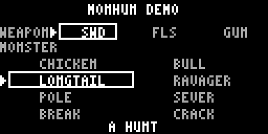

# monhun-ardu

Monster-Hunter-style top-down duel for **Arduboy FX** (ATmega32u4). Renders in
4-shade gray with ArduboyG `L4_Triplane`. `src/` is the source of truth.
`mock/` is a legacy browser prototype. It stays runnable as diagnostics. It is
not a gate.

---

## Demo



Download `monhun-ardu-<version>.arduboy` from
[Releases](https://github.com/FreezingSnail/monhun-ardu/releases). Flash it with
the Arduboy Toolset, MrBlinky's
[uploader.py](https://github.com/MrBlinky/Arduboy-Python-Utilities), or Ardens.
The archive holds the FX program, the Mini program, and the one FX data image
(`flashdata`). Plain hex files are attached for manual flashing. The shipping
build has no USB serial device.

### Demo build (`make demo`)

`make demo` builds a playtest image (`-DMH_DEMO=1`). It boots into a picker and
compiles the hub / quests / gear / forge / cards / EEPROM flows out. It then
opens Ardens. The hex stays in `dist/`.

| Input | Action |
|---|---|
| UP / DOWN | move the cursor over WEAPON / BEAST / GO (wraps) |
| A | cycle the selected row — weapon 1 of 3 (sword / flail / gun), beast 1 of 4 (lunge / sweep / heavy / ravager) — or launch from GO |
| B | inert on the picker |

GO runs `newGame()` for the picked weapon + beast. It drops the hunter at the
beast's home room entrance spawn. The beast stays at its monster spawn across
the room. The hunt opens with the hunter closing in from off-screen. Camp
hold-B or win/loss + A returns to the picker.

Package the demo:

```sh
python3 tools/package-arduboy.py --version vX-demo \
  --hex dist/monhun-ardu.ino.hex --fxdata fxdata/fxdata.bin --license LICENSE \
  --out dist/monhun-ardu-demo.arduboy
```

---

## Status snapshot

| Item | State |
|---|---|
| Vertical-slice sim | Ported + parity-verified (legacy diagnostics: 20 scenes / 1269 ticks / 660 asserts) |
| Device render + HUD | Working (block art + FX sprites; HUD text/bars; `7y3` clamp fixed) |
| Audio | Cue tones compiled out of shipping (`-DMH_AUDIO=0`). Module stays behind the flag. Device suites still test it |
| Host tests | `make test` — **7115 passed / 0 failed** |
| Device tests | 19 suites / 2153 asserts, all PASS (Ardens) |
| Demo content | 4 rooms (`camp` ↔ `area` ↔ `cavern` / `ridge`), gather + kill quests, 4 beast variants per weapon class, per-room beast homes |
| Perf gate | PASS: plane 157 Hz (≥135), logic 52 Hz (≥45), render max 3408 µs (≤7407), moving-room render max 3040 µs, tick 176 µs, bench RAM free 563 B |
| Shipping build | flash **29628 / 29696 B** (68 free), RAM **1867 / 2560 B** (693 free). Flags: `-DMH_NO_USB -DMH_AUDIO=0 -DMH_ROOM_IMAGE=0` |
| FX data image | **2,994,688 B** of 16 MB used: equip sheets 2.44 MB, 94 card pages 282 KB, block sheets 104 KB, 12 screen pages 36 KB, 4 room images 50 KB, fonts 6 KB, tables 7 KB |

Combat (sword / flail / gunshield), monster FSM, camera clamps, HUD, and audio
cues are in place. Trim waves cut training mode, damage numbers, screen shake,
the projectile trail, stage-3 finisher, roll attack, and the A-A-B branch
buffer from shipping. The demo wave added the content. `nx9` returned the
ground to the dot field and fixed the hunt-launch A edge. Open work: stale-cache
guards (`p71`/`cqw`), real art pass (`vx2`), feel tuning (`1to`), EEPROM save
(`qyb`).

---

## Architecture

```
mock/game.js ──port──► src/core/*.hpp ──shared verbatim──► host tests (tst/)
                              │                              and device .ino
                    device layer (monhun-ardu.ino)
                    ├─ input sampling (pollButtons → mh::Input)
                    ├─ render.hpp (arena, actors, FX sprites, HUD)
                    ├─ audio.hpp (edge-diff cues → ArduboyTones)
                    └─ ArduboyG plane loop + FX/OLED bracket
```

### Core (`src/core/`, header-only, no `Arduino.h`)

| Module | Responsibility |
|---|---|
| `fp.hpp` | Fixed-point layer: FP=16 (1/16 px), `tdiv`, `addMove`, `addVel`, `DIR8`, `isqrt`, `rotFp`, stamina drain |
| `game.hpp` | `Game` state, `Player`, weapon defs + monster attack tables (PROGMEM), `Rect`, hit callbacks, `HOLD_TICKS=11`, `WORLD_W=256`, `WORLD_H=112` |
| `player.hpp` | Player FSM: chains, branches, stances, stamina, guard / parry / deflect |
| `monster.hpp` | Monster FSM, attack cycle, windup, hit resolution, `pushApart` |
| `projectiles.hpp` | Effects (sparks) and the shell path, `stepWorld` |
| `world.hpp` | Geometry, camera (int px, clamped), `newGame` / `resetHunt` / `stepGame`, room load / door / heal + arrival toast, beast presence |
| `combat.hpp` | Combat blob loader: caches, guard eval, fixed 3-hitzone resolve. No per-tick cart reads |
| `input.hpp` | Edge flags + B-hold detection (`aP`, `bP`, `bR`, `bHeld`) |
| `progmem.hpp` | Flash-read shim: `MH_PROGMEM` + `mhPgmRead*`. Identity on host |

Rule: no `float` and no `double` in the sim. Positions are integer px plus a
1/16-px accumulator. Damage math truncates at each step.

### Device layer

- `monhun-ardu.ino` — plane loop, input sampling, `stepGame()` + `audioUpdate()`
  in `run()`, `renderScene()` in `render()`. Boots into the **hub**. A screen
  replaces the scene and stops the sim. A detail card replaces everything and
  takes A/B. FX reads run only inside the `FX::enableOLED()` /
  `waitForNextPlane()` / `FX::disableOLED()` bracket.
- `src/app_state.hpp` — host-testable routing: hub as root, quest-card hunt
  launch, held-button guards, over-screen return, once-per-hunt progress commit.
- `src/app_setup.hpp` — hunt start: beast kind from the quest, save weapon, kill
  counter, smith tier multipliers.
- `src/armor_state.hpp` / `src/armor.hpp` — armor engine + cart glue.
- `src/card_state.hpp` / `src/cards.hpp` — prebaked detail cards + nav.
- `src/render.hpp` — whole render path (arena, actors, sprites, HUD, cards,
  door blackout, `DEBUG_HURTBOXES` wire overlay).
- `src/audio.hpp` — cue detector over `Game` edges, one-shot tones. Shipping
  sets `-DMH_AUDIO=0` (no-op module, −652 B).
- `-DMH_NO_USB` — shipping links the sketch's own `main()`, so the USB/CDC
  stack never enters the image. Result: no serial port while the game runs.
- `make dev` — sandbox (`-DMH_DEV=1`): 9999 zenny, 99 items, EEPROM never
  touched. `make dev-hitboxes` adds the always-on hurt/hit wire overlay.

### FX asset pipeline

Sprites and fonts are packed for `SPRITESU_FX` and drawn with
`SpritesU::drawPlusMaskFX(x, y, img, FRAME(i))`, where `FRAME(x) = x*3 +
arduboy.currentPlane()`. MCU flash holds offset constants only. No glyph or
bitmap arrays live in MCU flash or RAM.

```
images/**/*.png ──tools/convert-sprite.py──► fxdata/*/Sprites.txt ─┐
data/**/*.json ──tools/gen-*.py──► tables/*.bin + src/generated/ ──┤
                                                                  ▼
                             fxdata/fxdata.txt ─► tools/gen.sh ─► fxdata-build.py
                                                                  │
                                            src/fxdata.h ◄────────┤
                                            fxdata/fxdata.bin ◄───┘
```

- Creature data is authored in JSON under `data/`. `tools/gen-combat.py`
  compiles it into the packed blob and the generated headers
  (`combat_data.hpp`, `combat_meta.hpp`, `combat_expect.hpp`). The blob is a
  section of the one FX image. See `docs/creature-framework.md`.
- One FX image only: `fxdata/fxdata.bin`. Table blobs are sections inside it.
- `fxdata/manifest.json` pins sha256 + size for every source and artifact.
  `make gen-check` re-runs the pipeline and fails on any change.
- Authoring review: `python3 tools/gen-combat.py --dump` validates JSON;
  `python3 tools/contact_sheet.py` renders attack timelines and hit windows.
- Fonts come from the FX cart. The vendored `Font4x6` was deleted.

### Test tiers

1. **Host** — `make test`. Suites in `tst/*_test.hpp`. Runs the core headers
   unmodified.
2. **Device** — `make fxtest-headless`. Each `tst/fxdatatest/test_*.ino` is
   staged, compiled with arduino-cli, booted in Ardens with the FX image, and
   must print a final `P` or `F`. Iterate with `FXTEST_ONLY=test_<name>`.
3. **Ardens** is required for tier 2. Set `ARDENS=/path/to/Ardens` to override.
   If Ardens is missing, the run skips cleanly.

### Hardware / cadence

- `L4_Triplane` + `ABG_TIMER1` + `ABG_SYNC_PARK_ROW` (`src/common.hpp`).
- Bench (nx9): plane 157 Hz, logic 52 Hz, render max 3408 µs, tick 176 µs,
  RAM free 563 B. Mock runs at 60 Hz; tick order matches.
- `DEBUG_HURTBOXES=1` (`make dev-hitboxes`) draws the player body, the beast's
  three hurt boxes, and the live hit boxes. Off by default.

---

## Controls

### Hub (boot — the root screen)

| Input | Action |
|---|---|
| UP / DOWN | move the cursor (6 rows per page, scroll by 6) |
| A | accept the cursor row (open a screen / card, take a quest, launch from the quest card) |
| B | back one level (quests/gear → hub; hub B is a no-op) |

D-pad nav is debounced. A tap moves one row. A hold waits ~300 ms (16 ticks),
then repeats every ~115 ms (6 ticks). A is edge-based: one accept per press. The
press that opened a screen cannot re-fire inside it.

The hub has three rows: QUESTS, FORGE, GEAR. The cursor boots on QUESTS. The
hub strip on the free y=56 line shows the equipped weapon marker (`SWD1` = class
abbreviation + tier) and active armor skill points (`ATK12`). Any list longer
than one 6-row page shows an `n/m` indicator. Every list shows the live zenny
balance on the title line. A blocked A plays a short denied cue.

Every list screen renders from prebaked 128x64 4-shade pages (one page per
6-row window). The device draws only the live chrome on top: cursor, selected
label, forge/gear markers, skill numbers. See `docs/ui-design.md`.

The FORGE screen lists every weapon node as an indented tree. A opens the
weapon card. A on the card forges the node. An owned parent makes it a cheaper
upgrade. Otherwise it is a pricier direct forge.

The GEAR screen equips the loadout. Weapon rows open the weapon card (A equips
or unequips). The five armor rows craft on first A, then toggle equip. A live
skill readout shows stacked points. A skill gets `S` at 10 points and `M` at 15
points. Points clamp at 15.

Weapon, armor, and quest rows open a **prebaked detail card**. LEFT/RIGHT cycles
pages. B backs to the list. A runs the row action. The card hint line shows the
live state (`A CRAFT`, `A EQUIP`, `A UNEQUIP`, `A ACCEPT`, `A TURN IN`,
`NEED PARTS`, `NEED ZENNY`, `A GO`).

Save v5 caps: 32 owned weapon-node slots (4 B) and 8 crafted armor-piece slots
(1 B). There is no migration. Only a version-5 record with a valid checksum
loads. Anything else falls back to defaults. Every state change commits the
44-byte EEPROM block once (write-on-change + verify read).

### Target roster (`MONSTER_DEFS`, FX cart blob)

| Target | Size | HP | Spd | Attack |
|---|---|---|---|---|
| LUNGE | 32x24 | 1200 | 5 | pecks inside 28 px, leaps 29..41 px (leap locks facing at windup) |
| SWEEP | 28x22 | 1000 | 7 | stomps inside 24 px, gores 25..41 px (gore locks facing at windup) |
| HEAVY | 40x28 | 1900 | 3 | lunges inside 24 px |
| RAVAGER | 32x24 | 1600 | 6 | breakable head/appendage zones, pattern-driven |

### In game (hunt)

| Input | Action |
|---|---|
| D-pad | move |
| D-pad double-tap | dodge roll toward the tapped direction (all weapons, sheathed too) |
| A | attack (in a stance: stance special) |
| A (sheathed, at a herb node) | gather the node (rooted ~40 ticks) |
| A (sheathed, at a carcass) | carve (win screen, 3 carves per hunt) |
| B tap | dodge (sword) / deflect (flail) / shove (gunshield); inert while sheathed |
| B hold ~11 ticks | enter stance (parry / whirl / guard); release exits |
| B hold ~11 ticks (sheathed, herb held) | eat a herb: +20 hp, rooted ~40 ticks |
| hold A ~24 ticks | sheathe (stow the weapon) |
| A (sheathed) | draw (rooted windup), then combo hit 1 |

Per-move numbers (startup/active/recover, boxes, damage, stamina, lunge/push)
live in `docs/weapon-movesets.md`.

**Rooms.** The camp door leads east into the area. The area forks north to the
cavern (safe mine, ore nodes) and east to the ridge (heavy beast). Every room
has its own doors, spawns, and heal rects. A door cross black-wipes the arena
for 12 ticks, then shows a 40-tick arrival toast. A beast exists only in its
home room. An off-home room reads empty: no sim, no target, no draw, no HUD bar.

There is no quit input in the hunt. Win/loss + A is the only exit. Camp hold-B
(sheathed) returns to the hub.

---

## Commands

```sh
make test               # host unit tests
make fxtest-headless    # Ardens device tests (19 suites; FXTEST_ONLY=test_combat for one)
make size               # whole-image flash/RAM report + data facts
make size-line          # flash/RAM line only
make test-tools         # Python tooling unittests
make dev                # dev sandbox build, then opens Ardens
make dev-hitboxes       # dev build + always-on hurt/hit wire overlay
make gen-check          # regen determinism + generated header sync
make build              # shipping sketch (output in dist/)
make debug              # build, then open Ardens debugger (ELF + FX image)
make mini               # compile for the Arduboy Mini FQBN
make demo               # demo picker build, then opens Ardens
make gen                # regenerate FX assets + fxdata.h/bin
make hooks              # install git hooks (once per clone)
make format             # format all tracked C-family sources
```

Full gate before a commit: `make gen-check`, `make test`,
`make fxtest-headless`, `make size`. Workflow conventions live in
`docs/dev-flow.md`.

`make debug` opens Ardens on `dist/monhun-ardu.ino.elf` + `fxdata/fxdata.bin`
with DWARF info. Keys: `F5` pause, `F8` reset, `O` settings, `F11` fullscreen.
The debugger also offers a CPU profiler, auto-breaks (stack, SPI collision, FX
busy), snapshots, screenshots, and GIF recording. Headless dump:

```sh
"$ARDENS" headless=3000 display=ssd1306 fxport=d1 \
    profiledump=build/profiler.txt \
    file=dist/monhun-ardu.ino.elf file=fxdata/fxdata.bin
```

Notes: `build`, `mini`, `gen`, `debug`, `hooks`, `format`, `test`, and `fxtest*`
are `.PHONY`, so they always rebuild. `.clang-format` defines the style (LLVM
base, 4-space, 200 col, LF). The pre-commit hook formats staged C/C++ files.

---

## Constraints / known issues

1. **Perf.** Two render fixes landed: incremental dot counters and the
   `MAX_FX_DRAW=6` effect cap, plus direct masked framebuffer writes in `blk()`.
   Any new feature must keep the perf gates green and fit the flash budget.
2. **Flash.** Current headroom: 68 B. Debug-only code must stay behind
   compile-time flags. Prefer FX data over MCU flash.
3. **RAM.** Current usage: 1867 B (693 free). Hot LUTs (`SIN65`, `DIR8`,
   `MH_MASK_TOP/BOT`, `RING6`, 119 B total) stay in MCU flash by decision: FX
   reads cost ~150 cycles each (~9 µs). A sine RAM cache would breach the free
   RAM gate.
4. **Mock is legacy.** `src/` is the source of truth. Do not update `mock/` and
   do not regenerate its parity fixtures.
5. **FX/OLED share SPI.** All FX reads must stay inside the bracket, never
   during the paint. Per-access cost is ~150 cycles (~9 µs).
6. **Parity fixes found real bugs**: hitstop gating, projectile cull boundary,
   missing hurt sparks, an isqrt seed bug, and a projectile double-scaling bug.
7. **HUD bars** were invisible on device (`blk()` clamped them out). Fixed
   (`7y3`): `blkClamp()` + `blk()` / `hudBlk()` wrappers. `test_hud` pins the
   framebuffer bytes.

---

## Design decisions

- **Grayscale**: `L4_Triplane` + `ABG_TIMER1` + park row. Accept the plane-bound
  cadence (157 Hz plane / 52 Hz logic). (`monhun-ardu-b3t`)
- **World**: scrolling camera, mock parity. FX has room for map growth.
  (`monhun-ardu-kpi`)
- **Assets**: everything on the FX chip. MCU flash holds code and PROGMEM
  tables only. (`monhun-ardu-kt7.2`)
- **Audio**: procedural one-shot tones, edge-diffed from sim state. No audio
  calls inside core logic. (`monhun-ardu-6zc`)
- **Hot LUTs** stay in MCU flash as a documented exception.
  (`monhun-ardu-42n.5`)

---

## Repo layout

```
monhun-ardu.ino     device sketch (plane loop, input, run/render wiring)
src/core/           host-testable sim (no Arduino.h)
src/render.hpp      device render path (also in the perf bench)
src/app_state.hpp   hub/screen/hunt routing
src/app_setup.hpp   hunt start + quest/tier arming
src/audio.hpp       tone cue detector
src/external/       ArduboyG, SpritesU, SpritesABC
src/fxdata.h        generated FX offset constants
src/generated/      generated headers
data/               creatures, map, quests, screens, forge, armor, items JSON
docs/               creature-framework, ui-design, map-zones, quests-shops,
                    weapon-art, weapon-movesets, feel-design, dev-flow
src/common.hpp      hardware config + FRAME macros
tst/                host suites + main
tst/fxdatatest/     Ardens device tests + harness
fxdata/             fxdata.txt, generated bins (tracked)
images/             source PNGs
tools/              generators, converters, manifest, tooling tests
mock/               JS prototype (legacy)
dist/               compile output
output.md           most recent worker report (scratch)
```

## Beads

Work is tracked with `bd` (epic `monhun-ardu-kt7`). Open items:

- `bhp` — weapon art pass follow-ups (`.7` docs/review, `.8` cleanup)
- `feel` — boss feel (`feel.11` player commitment tune)
- `fie` — demo map epic
- `prg.13` — hub ITEMS screen
- `05x` — equipment framework (paper-doll)
- `arm` — armor epic
- `cqw` — gen pipeline convergence assert
- `p71` — `make size` stale-ELF guard
- `vx2` — real 4-shade art pass (human)
- `1to` — device feel playtest + tuning (human)
- `qyb` — EEPROM save (deferred)
